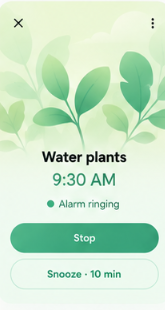
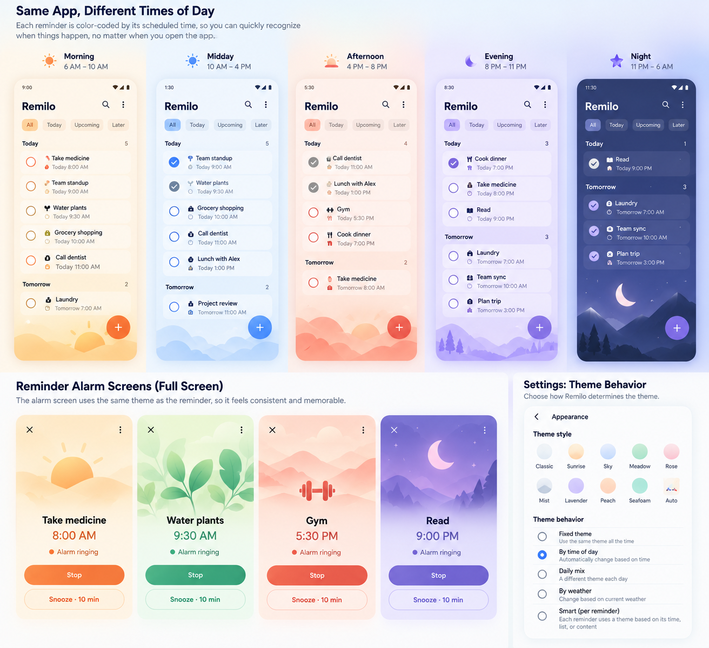
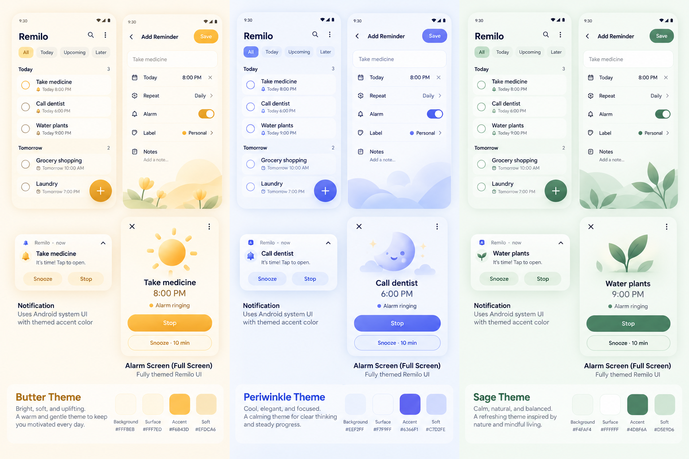
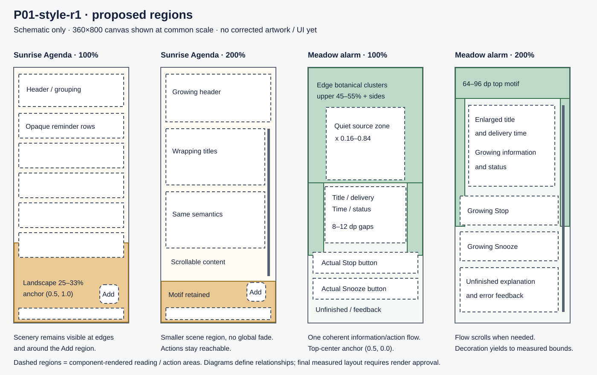

# P01 environmental art direction — proposed r1

Artifact ID: `P01-style-r1`, 6 October 2026. The exact SHA-256 is in
[the revision record](p01-style-r1.json). This document and its linked diagrams
are the proposed illustration contract submitted at P01's first design checkpoint.
The owner's execution instruction authorizes intake; it does not accept this brief.

Read the [visual review board](p01-style-review-r1.html),
[intake evidence](../evidence/2026-10-06-p01-intake.md) and
[immutable baseline manifest](../evidence/redesign-p01/baseline-20ea024/manifest.json).
The board distinguishes supplied mockups, fresh host renders, the historical
rejected screenshot and proposed region diagrams. There is no corrected artwork
or corrected UI render in this revision.

## 1. Authority and boundary

[P01](../plans/redesign/p01-art-direction.md), the
[product contract](../product.md), [appearance requirements](../appearance-redesign.md),
[architecture](../architecture.md), [verification](../verification.md) and
[A01–A03/A10](approvals.md) govern this work. The two review compositions are:

- Sunrise Agenda at 08:00 on 6 October 2026 in America/Los_Angeles.
- A single Water plants alarm in a full Meadow environment, with a review-only
  demonstration that the initial canvas persists across that session's membership changes.

This is a non-shipping art-direction milestone. Production navigation, appearance
preferences, classification, persistence, scheduling, audio, notification and
launcher behavior remain outside it. P02's catalog and production generalization
are separate work. Existing candidate assets and the exact Classic source identity
are preserved. The Classic icon's dimensional finish is not an environmental
illustration requirement.

## 2. Reference interpretation and audit

**Desired Water plants reference:** several broad leaf clusters enter from the
top and sides; overlaps produce a botanical setting. Mint/sage colors organize the
whole screen. A central quiet region supports title, time and actions. Adopt those
relationships. Its printed 9:30 AM, pixel geometry, lettering and contrast are
reference content, not product policy or approved tokens.

**Time board:** scenery has a broad horizon and distinct morning/day/evening
atmospheres. Agenda rows remain foreground information. Isolated alarm scenes
are richer than browsing surfaces. P01 samples Sunrise and Meadow only; it does
not reproduce the other periods or the board's printed time-policy suggestions.

**Butter/Periwinkle/Sage:** soft tonal transitions, overlapping hills, round foliage
and readable light foreground surfaces are useful. The desired Water plants
reference has stronger authority for botanical coverage than isolated object
examples elsewhere on this board. Printed swatches are not production tokens.

The [Classic board](references/supplied-classic-icon-board.png) remains the exact
identity input. The [historical rejected alarm](references/rejected-current-water-plants.png)
remains a negative reference with unknown source revision; it is not a current
HEAD capture. All five reference hashes match their preserved inventory.

### Fresh current renders and root causes

Current runtime sources/assets match `20ea024` and `9195784`. These are actual
RN components through the opt-in web preview and actual `AlarmControlsScreen`
through Robolectric native graphics, using authored synthetic reminders. They are
not Android system UI or physical-device evidence.

| Aspect | Current observation | Required correction after brief approval |
|---|---|---|
| Agenda scene coverage | The landscape is confined to a 220 dp image at bottom 64 dp. Hybrid opacity is 0.10 light, 0.025 dark and 0 at 200% text. Most visible scenery reads as a faint footer. | Give the canvas a Sunrise atmosphere; make the lower landscape and exposed edge forms recognizable through deliberate placement and tonal separation. |
| Botanical vocabulary | The native 180 dp artwork slot contains one centered, shaded sprig. Leaf highlights create a glossy/clay object rather than overlapping environmental silhouettes. | Use several edge-rooted botanical clusters and restrained layered depth. |
| Native hierarchy | Title/information are in the top block; actions sit at the bottom through `Arrangement.SpaceBetween`. At 100% text this leaves a large empty interval. | Put title, delivery, status, actions and unfinished explanation in one content sequence with measured gaps. |
| Native environment | Hybrid takes the Sunrise ambient scheme and only Meadow primary color; a separate 180 dp landscape footer sits behind actions/footnote. | Use a continuous Meadow canvas with one integrated botanical composition and clear action regions. |
| Large text | RN removes scenery by opacity; the native sprig keeps its fixed allocation as typography grows. Long titles need scrolling. | Reduce decorative allocation, preserve a recognizable edge motif and let all content/actions grow and scroll. |
| Foreground reading | RN's opaque rows and explicit overdue/postponed/missed wording are useful. Native Stop/Snooze are real Material controls. | Keep these components, state/timing semantics, labels and action ownership. |
| Expanded layouts | RN inspection still hard-codes 800 dp height and fills available width. Existing native gallery has only the 360×800 window. | Measure the review viewport and constrain readable columns; extend scenery across exposed canvas. |

The code causes are in `src/ui/design-review.tsx` (`ReviewPhone`/`artOpacity`),
`modules/remilo-alarm/android/src/debug/java/com/remilo/alarm/review/AlarmDesignReviewActivity.kt`
(hybrid color selection, backdrop and member artwork), and
`modules/remilo-alarm/android/src/main/java/com/remilo/alarm/system/AlarmControlsScreen.kt`
(top/bottom space-between layout). The old asset provenance explicitly asked for
centered clay-like artwork. Correcting opacity alone cannot correct that vocabulary.

## 3. Illustration vocabulary

| Rule | Concrete direction |
|---|---|
| Silhouettes | Broad rounded hills; asymmetric oval/teardrop leaves with soft tips; curved stems; simple rounded cloud groups; one sun integrated into the sky/horizon. |
| Composition | Forms enter from screen edges and overlap across several depth layers. Avoid a symmetric centerpiece with empty surroundings. |
| Depth | Two to four large silhouette layers with modest tonal gradients. Overlap and scale establish distance. No glossy specular highlight, extruded/clay volume or floating-object shadow. |
| Detail | Sparse vein/stem accents, quieter than the silhouette. No fine detail needed to identify the scene at 360 dp. A small amount of soft texture may be evaluated on the sources; it must not look like glitter or speckled noise. |
| Sunrise personality | Warm cream atmosphere, pale honey sun, peach distant terrain and muted warm sage foreground. Broad horizon, calm open sky. |
| Meadow personality | Mint atmosphere, pale sage distant leaves and deeper green foreground clusters. Multiple plants shape the upper and side regions. |
| UI relationship | Text, buttons, glyphs, rows and labels are rendered by components. Artwork contains no writing, controls, cards, frames or logos. The primary environment spans the canvas. |
| Exclusions | Bokeh, floating orbs, glitter, glossy/clay plants, isolated centered sprigs, unrelated landscape-plus-object collage, generated UI and reinterpretation of Classic. |

Do not globally reduce the whole scene to 10% opacity as the composition strategy.
Use authored color relationships, clear quiet regions, opaque foreground reading
surfaces and measured contrast. Decorative imagery is silent to accessibility and
has no pointer handling. No decorative animation or appearance transition is added.

## 4. Scene regions, anchors and hierarchy

The diagrams show schematic regions only. Their colored rectangles and dashed
bounds are explanatory annotations, not corrected illustrations or final UI.
Coordinates below refer to the available canvas after real safe-area insets,
with normalized origin at top left. They are P01 prototype starting constraints,
not a dimension catalog for later screens. Content reflow takes precedence over
fractional scene positions.

### Sunrise Agenda

- Atmosphere covers the canvas. The main landscape occupies the lower **25–33%**
  at 100% text. Its normalized crop anchor is **(0.5, 1.0)**, preserving a horizontal
  horizon and foreground at the bottom. The integrated sun's source focal region
  is around **x 0.55–0.75**, within the landscape's sky band.
- Sparse restrained forms may extend along exposed edges. Keep meaningful scenery
  visible around the Add region and beside rows, without reserving a large empty
  section between reminders. Do not put the primary scene in a card.
- Reminder surfaces stay near-white and opaque in light mode, opaque dark surfaces
  in dark mode. Text-safe regions are the actual row surfaces and header/control
  bounds, with at least **8 dp** clear space from high-detail edges.
- Preserve current event-based Today/Tomorrow grouping and authored Water plants,
  medicine, work and later reminders. Separate overdue and changed-delivery cases
  retain all timing/work/delivery wording. Category glyphs/accents remain restrained
  authored fixture descriptors, never classifier output.
- Use existing system typography: review heading roughly **24–28 sp**, row title
  **16 sp**, supporting information **14 sp** at 100%. These scale with text settings;
  do not reduce font size to protect a scene. Rows wrap and grow without essential
  title truncation. Done, More and Add targets remain at least **48×48 dp**.
- At 200%, reduce the landscape region toward **12–18%**, keep a recognizable
  horizon/edge motif and scroll reminders. The Add action and existing review
  navigation remain reachable, with no artwork stealing hit areas.
- At 412×915 and 800×1024, use a maximum **560 dp** readable content column, centered
  inside safe bounds. The environment fills the wider canvas; source shapes keep
  their aspect ratio. Inspection height comes from the measured viewport.

### Meadow Water plants alarm

- Apply a full Meadow color scheme to the canvas, information and actions. The
  main botanical region reaches through approximately the upper **45–55%** at
  100% text and along both sides. Use **(0.5, 0.0)** as the shared top-center crop
  anchor; foreground clusters originate at left/right edges. Keep at least three
  discernible botanical groups, without one isolated centered sprig.
- Keep the central **x 0.16–0.84** of the upper/middle source substantially quiet.
  On a 360 dp canvas, the actual title/time/action blocks may occupy wider padded
  bounds; mask/crop/reposition decoration away from those measured bounds. The
  nominal quiet source zone alone does not establish safe contrast.
- Treat title → current ringing delivery label → target time → ringing status →
  Stop/Snooze → unfinished explanation/feedback as one sequence. Start with
  **8–12 dp** information gaps, **20–28 dp** before actions, and **12 dp** between
  actions. Avoid pushing controls to the bottom by a large expanding middle gap.
- Use the actual `AlarmControlsScreen` information/action/feedback blocks. Start
  with existing Material typography (headline approximately **28 sp**, time
  **22 sp**, supporting text **14–16 sp**); keep Stop prominent and Snooze distinct.
  Preserve Material filled/outlined buttons with at least **48 dp** targets and
  natural height growth. Their existing 64 dp minimum can remain.
- The visible time is the **current ringing delivery** at 08:00. Show consequential
  event/due relationships in separate fixture metadata when they differ. The
  reference's 9:30 AM must not replace the fixture's delivery target. Keep the
  explicit sentence that Stop leaves the reminder unfinished.
- At 200%, shorten the top decorative breathing space to approximately **64–96 dp**
  and retain side/top motifs. Allow the complete sequence to scroll; capture both
  top and controls. Do not reserve a fixed 180 dp object before an enlarged title.
- At expanded sizes, keep the information/action column at most **480 dp** while
  scenery fills the canvas. Reposition/crop edge groups without stretching leaves.
- A debug-only canvas descriptor is initialized once for each fixture session ID.
  Joining medicine, reordering members and removing Water plants in that same
  session must leave Meadow unchanged. A new session initializes anew. This is a
  review demonstration, not P08's durable production mechanism.

### Crop and overlap rules shared by both renderers

Use one documented source coordinate system and aspect-preserving uniform scale.
Match the selected crop rectangle/anchor in RN and Compose rather than assuming
their default `contain`/`Fit` placements agree. At different aspect ratios, extend
the solid atmospheric canvas and crop/reposition the decorative layer; never
stretch it. Preserve sun/horizon or at least one recognizable botanical cluster.

No essential text, focus outline, selection marker or action target may intersect
a detailed silhouette unless measured composite contrast passes and hierarchy
remains clear. Maintain **8 dp** visual clearance around essential blocks. Never
place action text over leaves through a transparent button. Scenery does not
convey work/delivery state; wording and established symbols do.

## 5. Light/dark and fallback relationships

Light Sunrise is cream/honey/peach; light Meadow is mint/sage. Dark treatments keep
the same silhouettes and anchors, with warm charcoal for Sunrise and forest/slate
green for Meadow, lighter muted foliage and deliberately readable foreground
roles. Do not darken a flattened UI image or fade away the scene.

Review-only starting foreground/fallback roles can reuse the current candidate
families while scene colors are authored under this brief. They are proposals,
not accepted production tokens:

| Role | Sunrise light / dark | Meadow light / dark |
|---|---|---|
| Safe canvas fallback | `#FFFBF2` / `#1C1A12` | `#F5FAF6` / `#142019` |
| Opaque reading surface | `#FFFFFF` / `#28251B` | `#FFFFFF` / `#203027` |
| Primary text | `#14203A` / `#F4F0E7` | `#14203A` / `#EDF5EF` |
| Action family | deep honey / pale honey | deep green / pale mint |

Final scene/action shades require actual composited measurements. Invalid review
tokens or missing art resolve to readable solid roles with usable text/actions.
Generic-before-unlock fixtures use generic text and omit decoration/private content.
This does not change protected storage or production privacy policy.

## 6. Asset and component production after approval

Use static raster environmental artwork and component-rendered UI. Existing RN
`Image`, Compose `Image` and debug drawable resources support this without a new
SVG/Skia/animation dependency. Uniform scaling/crop placement must be explicit.
This is an agent technical choice within the approved scope; it does not accept
the generated source or resulting render.

After this exact brief is accepted:

1. Use the built-in imagegen workflow for only the Sunrise landscape and Meadow
   botanical composition. Prompts use this vocabulary, region coverage and quiet
   zones, explicitly exclude UI/text/logo, and specify transparency for decorative
   layers. Supplied references are inspiration. Generate no complete UI screenshot.
2. Inspect environmental coverage, leaf/hill silhouette quality, transparency,
   glossy artifacts and consistency before integration. Reject a source that
   repeats the isolated sprig even if its colors look attractive.
3. Preserve originals, prompts, source reference IDs and SHA-256 hashes. Add versioned
   sibling assets; do not overwrite `landscape.png`, `botanical.png` or icon candidates.
4. Make light/dark treatments of these same two compositions with common geometry
   and anchors. Export bounded PNGs at up to **1440 px** width, without enlarging
   smaller sources. Copy matching pixels to the debug Android source set.
5. Add a P01-specific export/check path. Never invoke the broad exporter that
   regenerates every palette/icon variant. A review-only composition descriptor
   contains scene ID, asset revision, brightness, crop and decorative/content-safe
   regions; it contains no persisted policy or classifier result.
6. Add current/corrected inspection to the existing RN workspace while retaining
   the existing A/B/C screens and real `ReminderRow`/buttons/status components.
7. Add only the narrow optional single-member presentation slot needed by Compose:
   it receives actual information, action and feedback blocks, while its default
   keeps production layout/callbacks. Debug code composes the corrected layout.
   Fake callbacks stay memory-only. No bridge/schema/engine acquisition changes.

Consequential event/due fixture metadata stays in debug presentation inputs. Do not
extend `AlertRecord`, `SessionSnapshot`, credential/operational schemas or backups.
Native serialized mutations, stale-generation rejection, Stop ≠ Done, 10-minute
Snooze and the five-minute audio deadline remain unchanged.

## 7. Render verification and acceptance

After integration, render both actual screens at **360×800, 412×915, 800×1024**,
light/dark, 100%/200% text, standard/long English/long Simplified Chinese content.
Also inspect overdue/changed-delivery Agenda, alarm consequential timing,
same-session membership changes, generic content, action errors and art/token
fallback. Preserve baseline originals and place supplied/current/corrected images
at equal display width with intact aspect ratio, labels outside and content/time
differences identified. Host evidence stays labeled synthetic.

Verify actual composites: normal text **≥4.5:1**, large text **≥3:1**, essential
control/selection/focus indicators **≥3:1**. A paired background-only sampling
render must preserve measured element layout so image pixels beneath text are
included. Do not claim contrast from token pairs alone. Record text/action bounds,
wrapping, clipping, safe areas, scroll reachability and target overlaps. Inspect
web roles/labels/state and Compose semantics, decorative exclusion, grayscale,
reduced motion (static scenery), and missing-art/invalid-token fallback.

Focused tests cover semantic equality, session canvas stability, captured action
identity/unfinished semantics, large-text reachability, generic privacy, export
parity/fallback and unchanged production defaults/review isolation. Run complete
shared verification, read-only asset checks, focused native graphics tests and
serial `verify:android` after review implementation. No installation is authorized.
Use the documented process-local temp workaround if required; do not weaken tests
or change dependency versions. TalkBack, Android keyboard/system notification
rendering and physical reliability remain P12/device acceptance work.

## 8. Risks and approval scope

| Risk | Mitigation / acceptance evidence |
|---|---|
| Generated art returns glossy sprigs | Approve these vocabulary/coverage constraints first; inspect source art before integration. |
| Different crop behavior | Shared coordinate/anchor description, matching pixels and cross-renderer comparisons. |
| Large text hides the scene or controls | Reduce decorative space, preserve edge motif, reflow/scroll, record top/control bounds. |
| Presentation slot changes production | Default regression capture/tests and release/debug isolation checks. |
| Canvas follows mutable member order | Session-ID initialization separate from membership; join/reorder/remove/new-session tests. |
| Evidence has ambiguous origin | Commit plus dirty-input hashes, fixture/content/art hashes and exact renderer/layout settings. |
| Tooling/renderer limitations | Record actual failures and resolve them or obtain an explicit bounded deferral. |

**Checkpoint 1 submission:** accept/revise `P01-style-r1` (this brief plus the
region diagram). Approval accepts the vocabulary, hierarchy, scene regions,
responsive/dark constraints and bounded asset/component approach. It does not
accept unbuilt artwork or renders. Record the exact revision/hash and conditions
in the ledger before corrected asset/composition work.

**Checkpoint 2 remains mandatory:** the owner must explicitly accept both actual
corrected screen revisions, responsive/dark behavior and accessibility evidence
before P01 completion or an accepted handoff. Material changes require renewed
acceptance. Update live task status only in backlog; stop after P01.
